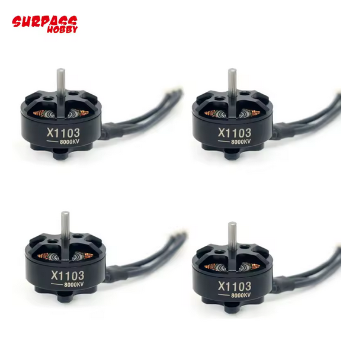
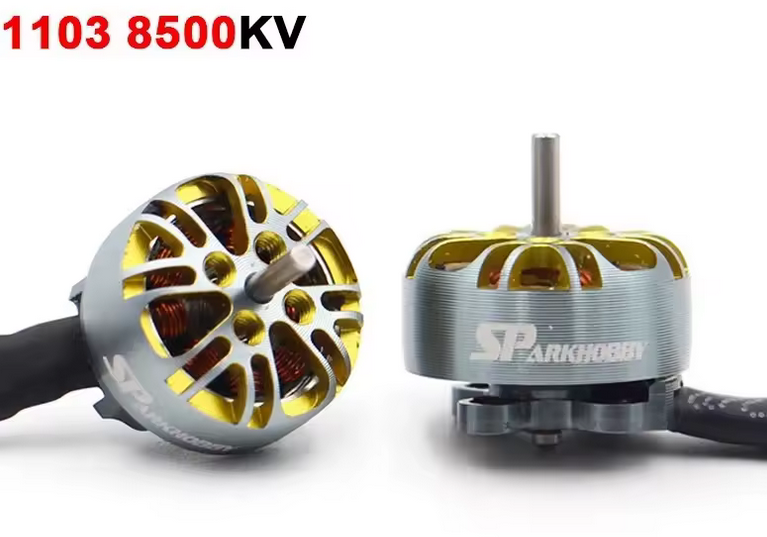
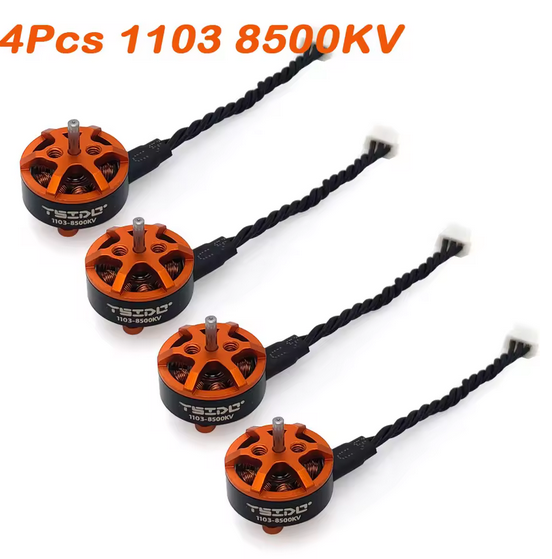
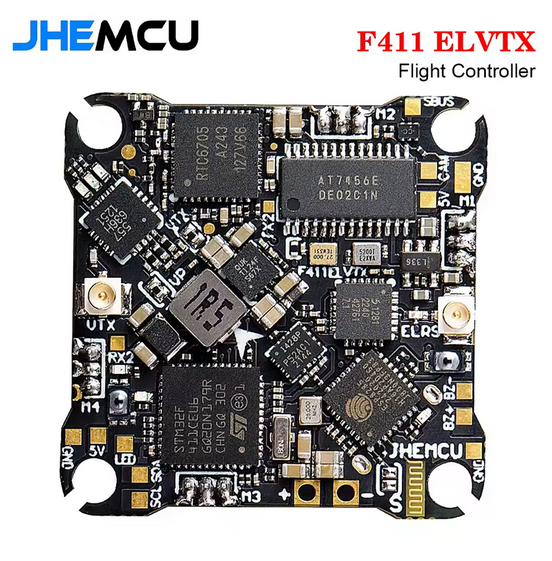
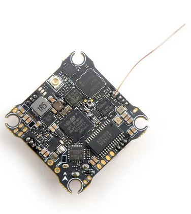
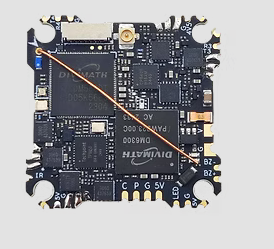
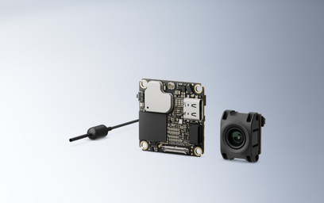
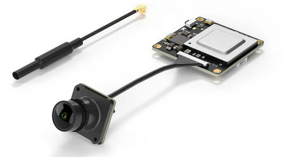
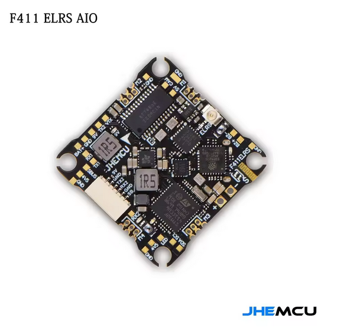
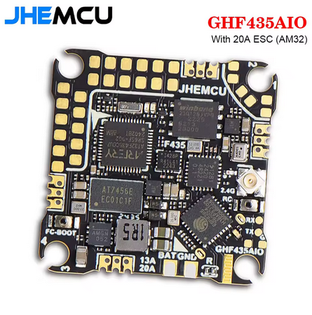

# Grognatiny — Light & Durable 2.5" fpv frame
(alias : how to make the PERFECT tiny fpv quad)

##  Key Features : 
*  **take advantage of the carbon fiber**: engineered specifically for carbon fiber mechanical  properties.
*  **Full component protection**: Compact structure that perfectly shields 25*25 aios and lite hd vtx.
*  **ultra lite, carbon parts weight about 11g, and the hardware (12 screws, 4 nuts and 4 standoffs) wheight about 2.5g
*  **Camera mount compatibility**: Fully supports all **KayouMini TPU "Camera Mounts"**.

# recommended components

##=========================================
## **motors**: you can choose any motor with thoses specs : 6500kv-9000kv 1103
### (you should buy 2 packs of 4, motor is the only thing that can break at this format)
##=========================================
### 22€ 4pcs **surpasshobby** : 3.6g, 8000kv; good for an analog build

https://fr.aliexpress.com/item/1005008163135913.html

### 28€ 4pcs **sparkhobby** : 4.5g, 8500kv; verry strong, better kv, ideal for a hd build

https://fr.aliexpress.com/item/1005009184817863.html

### 22€ 4pcs **sparkhobby** : 3.6g, 8500kv; lite, cheap, higly available, but not estetical.

https://fr.aliexpress.com/item/1005006640914306.html

##=========================================
## **vtx camera and aios**: one requirement : liteweight
##=========================================
## **analog**: congrat, your a goat, you can use an aio with integrated vtx : 
### 55€ **jhemcu elvtx** : 5g, 12a esc, 400mw vtx; a cheap 5in1 aio

https://fr.aliexpress.com/item/1005009013813390.html

### 70€ **happymodel x12** : 5g, 12a esc, 400mw vtx; perfect example of "more expensive does not necessarily mean better quality"

https://fr.aliexpress.com/item/1005005121813059.html

### 25€ **caddx Baby ratel 2** : 3.5g, 165 fov; the only good camera for this quad, you can flight during the night and have a night vision

https://fr.aliexpress.com/item/1005009014429309.html

### 17€ **betafpv co3** :  1.1g, 155 fov; if you realy need to save thoses 2g, and 2 bucks less low light performance but still good in the day (you could already have one from a brocken air65 :o)

https://fr.aliexpress.com/item/1005007644657307.html

## 100€ **hdzero** : be a goat and choose the AIO15 to be like analog pilotes (choose yourself a camera, idk hdzero)

https://www.hd-zero.com/product-page/hdzero-aio15

## **hd vtx**: you fly hd ? it's fine, you need one of thoses vtx : 
### 105€ **dji** : o4 (lite) 8.5g (including cam)

https://store.dji.com/fr/product/dji-o4-air-unit

### 90€ **walksnail** : avatar hd mini 5.1g

https://caddxfpv.com/products/walksnail-avatar-hd-mini-1s-lite-kit

## **HD aio (without an integrated vtx)**: you need to keep it liteweight :
### **jhemcu elrs; 5g, 12a esc, elrs

https://fr.aliexpress.com/item/1005007805656123.html

### **jhemcu f435; 5g, 20a esc, elrs

https://fr.aliexpress.com/item/1005007942847361.html

##=========================================
## **battery choices**: witch lipo and charger should you buy
##=========================================
(work in progress)

##=========================================
## **tpus instructions**: how to choose and print thems
##=========================================
(work in progress)
  * 📎 Available under Creative Commons 4.0 license:
    👉 [KayouMini 2.5 TPU Collection on Printables](https://www.printables.com/model/833046-kayoumini-25-tpu-collection/files)

##=========================================
## **carbon manufacturer instructions**: REALY IMPORTANT if you want a strong frame
##=========================================
(work in progress)

| Component       | Details                                     |
| --------------- | ------------------------------------------- |
| Top plate       | 2mm thick  t700 carbon                      |
| Bottom plate    | 3mm thick t700, 2 direction carbon required |
| Standoff height | 8mm for integrated aio and 12mm for hd vtx  |

> **Grognatiny** is an **original creation**. Only the dimensions of KayouMini camera TPU mounts were used to ensure perfect compatibility.

## 📎 License

This project is distributed under a CC BY 4.0 licence
https://creativecommons.org/licenses/by/4.0/
